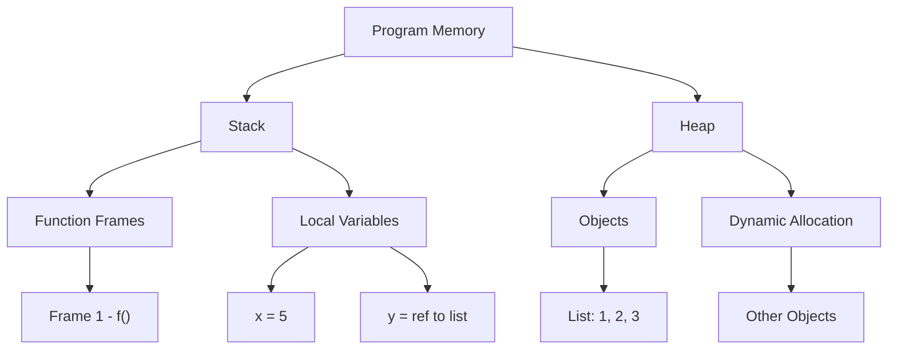
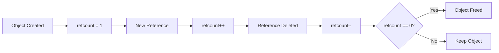
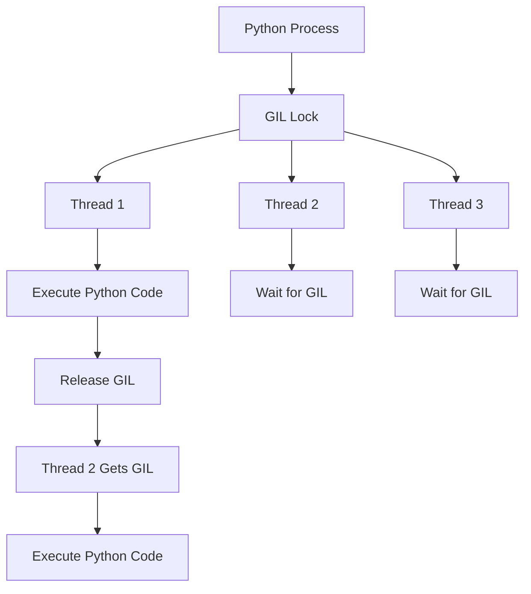

# Memory & Async — Junior Python Q&A (detailed, simple words)

## Оглавление
1. Memory: stack vs heap
2. Reference counting & GC (how Python manages memory)
3. Memory leaks — common causes in Python
4. GIL: what and why
5. Threads vs Processes vs Asyncio — when to use
6. Asyncio internals: event loop, tasks, coroutines
7. Common interview questions (short answers)
8. Visual diagrams (mermaid + ASCII)

---

## 1. Stack vs Heap (simple)
- **Stack**: место для локальных переменных и вызовов функций. Быстрая память, LIFO.
- **Heap**: где хранятся объекты (list, dict, class instances). Менеджер памяти выделяет/освобождает.

**Example:**
```python
def f():
    x = 5  # stored in stack frame
    y = [1,2,3]  # y reference in stack, list object in heap
```

### Memory Layout Visualization


---

## 2. Reference counting & Garbage Collector
- CPython использует **reference counting**: у каждого объекта счётчик ссылок.
- Когда счётчик = 0 → объект освобождается немедленно.
- Но reference counting не справляется с **циклическими ссылками** (A->B->A). Для этого есть циклический GC (`gc` module).

**Как проверить:**
```python
import sys
a = []
print(sys.getrefcount(a))  # показывает count (включая временные)
```

### Reference Counting Flow


---

## 3. Memory leaks in Python — common causes
- Большие объекты в глобальных контейнерах (list/dict) и забытые ссылки.
- Cycles with `__del__` — если объекты имеют `__del__`, GC может не удалить их.
- C-extensions bugs (например, неосвобождённая память).
- Long-lived caches without eviction.

**Fix tips:**
- Use weakrefs for caches: `weakref.WeakValueDictionary`
- Explicitly `del obj` and call `gc.collect()` для отладки
- Profile with `tracemalloc` and `objgraph`

### Memory Leak Detection Tools
```python
import tracemalloc
import gc

# Start tracing
tracemalloc.start()

# Your code here
data = [i for i in range(1000000)]

# Take snapshot
snapshot = tracemalloc.take_snapshot()
top_stats = snapshot.statistics('lineno')

# Show top 10
for stat in top_stats[:10]:
    print(stat)

# Force garbage collection
gc.collect()
```

---

## 4. GIL (Global Interpreter Lock)
- **Что**: глобальная блокировка в CPython, которая гарантирует, что в любой момент выполняется только один поток Python байткода.
- **Почему**: упрощает управление памятью (refcounting).
- **Влияние**: потоки не дают параллелизма по CPU; полезны для I/O-bound задач.
- Для CPU-bound — используем `multiprocessing` или C-extensions (release GIL).

**Short example:**
- I/O bound: `threading` хорошо (waiting on network)
- CPU bound: `multiprocessing` или написание расширений на C

### GIL Visualization


---

## 5. Threads vs Processes vs Asyncio
- **Threads**: лёгкие, разделяют память, хороши для I/O-bound.
- **Processes**: separate memory, true parallelism (multi-core), IPC overhead.
- **Asyncio**: single-threaded concurrency via event loop, ideal для many concurrent I/O tasks (HTTP clients/servers).

**Rule of thumb**:
- If many network requests → `asyncio`
- If heavy CPU tasks → `multiprocessing`
- If simple background I/O → `threading`

### Comparison Table
| Feature | Threads | Processes | Asyncio |
|---------|---------|-----------|---------|
| Memory | Shared | Separate | Shared |
| CPU Parallelism | No (GIL) | Yes | No |
| I/O Concurrency | Yes | Limited | Excellent |
| Overhead | Low | High | Very Low |
| Best For | Simple I/O | CPU-bound | Many I/O tasks |

---

## 6. asyncio internals — event loop, coroutine, task (под капотом)
- **Coroutine**: функция с `async def`. Она возвращает coroutine object (не выполняется пока её не awaited).
- **Task**: wrapper that schedules coroutine on event loop (`asyncio.create_task()`).
- **Event loop**: главный цикл, который переключает между задачами, управляет I/O и таймерами.

**Simple code:**
```python
import asyncio

async def fetch(x):
    await asyncio.sleep(1)
    return x*2

async def main():
    tasks = [asyncio.create_task(fetch(i)) for i in range(3)]
    results = await asyncio.gather(*tasks)
    print(results)

asyncio.run(main())
```

### Event Loop Flow
```mermaid
flowchart LR
  A[Start main()] --> B[Create tasks]
  B --> C[Event Loop]
  C -->|schedule| D[Task1: coroutine]
  C -->|schedule| E[Task2: coroutine]
  D -->|await I/O| F[OS waits]
  E -->|await I/O| F
  F -->|I/O done| D
  F -->|I/O done| E
  D --> G[complete]
  E --> G
  G --> H[results]
```

**ASCII event loop (quick):**
```
+-----------------------------+
| Event Loop                  |
|  - Check ready tasks        |
|  - Poll IO (epoll/kqueue)   |
|  - Resume coroutines        |
+------------+----------------+
             |
     +-------v--------+
     | Task1: running |
     +-------+--------+
             |
     +-------v--------+
     | Task2: waiting |
     +----------------+
```

### Async/Await Under the Hood
```python
# What happens when you write:
async def example():
    result = await some_async_function()
    return result

# Under the hood (simplified):
def example():
    # Creates a coroutine object
    coro = some_async_function()
    
    # If coro is not done, yield control to event loop
    if not coro.done():
        yield coro
    
    # When resumed, get the result
    result = coro.result()
    return result
```

---

## 7. Common interview Qs (memory & async) + short answers

### Memory Questions

**Q: What's the difference between stack and heap?**
**A:** Stack = local frames and variables; heap = dynamically allocated objects. Stack is faster but limited size, heap is slower but flexible.

**Q: How does Python free memory?**
**A:** CPython uses reference counting (immediate) + cyclic garbage collector (for circular references).

**Q: How to detect memory leak?**
**A:** Use `tracemalloc`, `objgraph`, monitor RSS, look for unexpected growth patterns.

**Q: What is reference counting?**
**A:** Each object has a counter of references. When counter reaches 0, object is immediately freed.

**Q: What are circular references?**
**A:** When objects reference each other in a cycle (A→B→A). Reference counting can't handle this, so cyclic GC is needed.

### GIL & Threading Questions

**Q: What is GIL and how it affects threading?**
**A:** Global Interpreter Lock prevents multiple threads from executing Python bytecode simultaneously. Only one thread can run Python code at a time.

**Q: How to achieve parallel CPU work in Python?**
**A:** Use `multiprocessing` (separate processes) or write C extensions that release the GIL.

**Q: When should I use threading vs multiprocessing?**
**A:** Threading for I/O-bound tasks, multiprocessing for CPU-bound tasks.

**Q: Can threads share memory in Python?**
**A:** Yes, but only one thread can execute Python code at a time due to GIL.

### Asyncio Questions

**Q: Difference between coroutine and thread?**
**A:** Coroutine cooperatively yields control; threads are preemptive OS threads managed by the OS.

**Q: What is `asyncio.gather()` vs `await`?**
**A:** `gather` schedules many coroutines concurrently and waits for all; `await` waits for one coroutine.

**Q: How event loop waits for I/O?**
**A:** Through OS-level poll mechanisms: epoll (Linux), kqueue (macOS), IOCP (Windows).

**Q: What is the difference between `async def` and `def`?**
**A:** `async def` creates a coroutine function that returns a coroutine object; `def` creates a regular function.

**Q: Can I use `await` outside async function?**
**A:** No, `await` can only be used inside async functions or coroutines.

---

## 8. Advanced Concepts

### Memory Management Deep Dive

```python
import weakref
import gc

class Node:
    def __init__(self, value):
        self.value = value
        self.parent = None
        self.children = []

# Circular reference example
parent = Node("parent")
child = Node("child")
parent.children.append(child)
child.parent = parent

# This creates a cycle - refcounting won't free them
del parent, child
print("Objects still exist:", len(gc.garbage))

# Force garbage collection
gc.collect()
print("After GC:", len(gc.garbage))
```

### Async Patterns

```python
import asyncio
import aiohttp

# Concurrent HTTP requests
async def fetch_url(session, url):
    async with session.get(url) as response:
        return await response.text()

async def main():
    urls = ['http://example.com', 'http://httpbin.org/delay/1']
    
    async with aiohttp.ClientSession() as session:
        # Concurrent execution
        tasks = [fetch_url(session, url) for url in urls]
        results = await asyncio.gather(*tasks)
        return results

# Run the async main
results = asyncio.run(main())
```

### Memory Profiling Example

```python
import tracemalloc
import psutil
import os

def profile_memory():
    # Start tracing
    tracemalloc.start()
    
    # Your code here
    data = []
    for i in range(100000):
        data.append(f"item_{i}")
    
    # Get current memory usage
    process = psutil.Process(os.getpid())
    memory_info = process.memory_info()
    print(f"RSS: {memory_info.rss / 1024 / 1024:.2f} MB")
    
    # Get tracemalloc stats
    snapshot = tracemalloc.take_snapshot()
    top_stats = snapshot.statistics('lineno')
    
    print("Top 10 memory allocations:")
    for stat in top_stats[:10]:
        print(stat)
    
    tracemalloc.stop()

profile_memory()
```

---

## 9. Tools & Commands for Debugging

### Memory Debugging
- `tracemalloc` — snapshot memory allocations
- `objgraph` — see object graphs and leaks
- `psutil` — monitor process memory/CPU
- `python -X dev` — add debug runtime checks
- `memory_profiler` — line-by-line memory usage

### Async Debugging
- `asyncio.get_running_loop().set_debug(True)` — enable loop debug
- `asyncio.run()` with debug=True
- `asyncio.all_tasks()` — see all running tasks
- `asyncio.current_task()` — get current task

### Useful Commands
```bash
# Monitor memory usage
ps aux | grep python

# Profile Python script
python -m memory_profiler script.py

# Run with debug info
python -X dev script.py

# Check for memory leaks
python -c "import gc; print(gc.get_stats())"
```

---

## 10. Best Practices

### Memory Management
1. Use `weakref` for caches to avoid circular references
2. Explicitly `del` large objects when done
3. Use generators instead of lists for large datasets
4. Profile memory usage in production
5. Monitor for memory leaks regularly

### Async Programming
1. Use `asyncio.gather()` for concurrent operations
2. Don't mix sync and async code unnecessarily
3. Use `async with` for resource management
4. Handle exceptions in async code properly
5. Use `asyncio.create_task()` for fire-and-forget operations

### Threading Best Practices
1. Use `threading.Lock()` for shared data
2. Prefer `queue.Queue()` for thread communication
3. Use `threading.Event()` for signaling
4. Avoid sharing mutable objects between threads
5. Use thread-local storage when needed

---

## 11. References
- [CPython Memory Management](https://docs.python.org/3/c-api/memory.html)
- [asyncio Documentation](https://docs.python.org/3/library/asyncio.html)
- [GIL Explanation](https://wiki.python.org/moin/GlobalInterpreterLock)
- [Memory Profiling Tools](https://docs.python.org/3/library/tracemalloc.html)
- "Fluent Python" by Luciano Ramalho (asyncio chapter)
- Official Python docs: `gc`, `tracemalloc`, `asyncio`, `threading`
